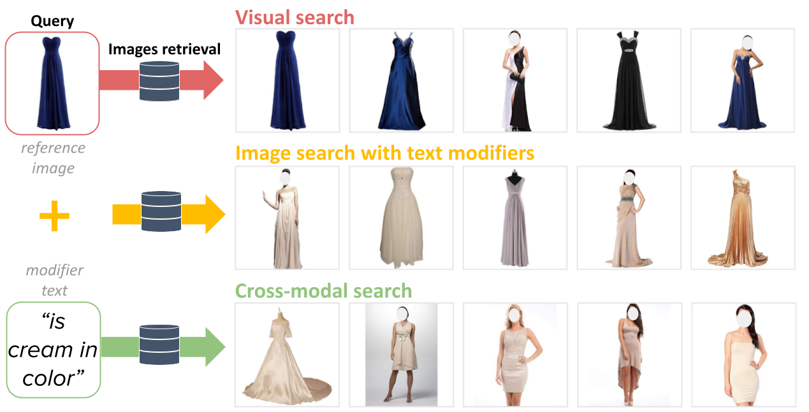
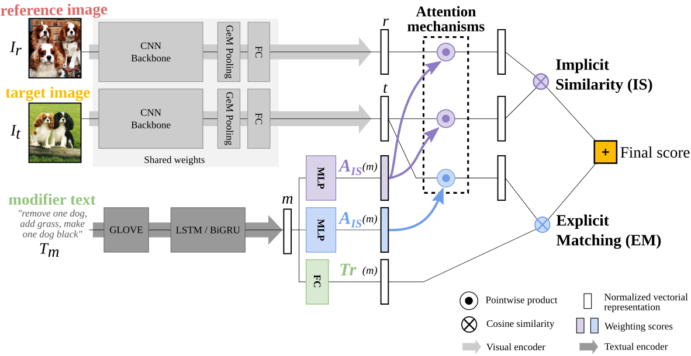
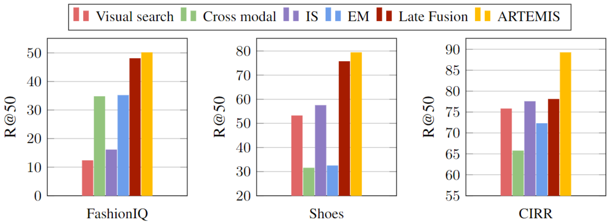
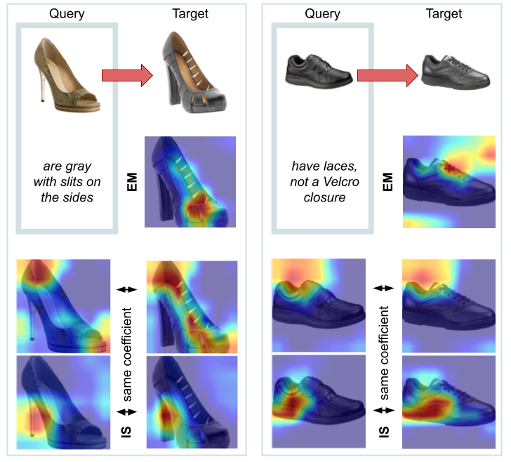

# ARTEMIS code release

This repository contains the code release of ARTEMIS, from our paper: 

[**ARTEMIS: Attention-based Retrieval with Text-Explicit Matching and Implicit Similarity**](https://openreview.net/pdf?id=CVfLvQq9gLo) 
Ginger Delmas, Rafael Sampaio de Rezende, Gabriela Csurka, Diane Larlus,
ICLR 2022.
[\[Project page\]](https://europe.naverlabs.com/research/computer-vision/artemis)

If this code and/or paper is useful in your research, please cite:

```bibtex
@inproceedings{delmas2022artemis,
  title={ARTEMIS: Attention-based Retrieval with Text-Explicit Matching and Implicit Similarity},
  author={Delmas, Ginger and Rezende, Rafael S and Csurka, Gabriela and Larlus, Diane},
  booktitle={International Conference on Learning Representations},
  year={2022}
}
```

## License
This code is distributed under the CC BY-NC-SA 4.0 License. See [LICENSE](LICENSE) for more information.

## The task
We address the problem of *image search with free-form text modifiers*, which consists in ranking a collection of images by relevance with respect to a bi-modal query: a *reference image* and a *modifier text*.



## Our method

Current approaches typically combine the features of each of the two elements of the query into a single representation, which can then be compared to the ones of the potential target image.\[1,2,3\]

Departing from these strategies, we draw inspiration from two fields related to the task, *cross-modal* and *visual search*, and we advocate for a combination of the two components of the query taking into account their relationships with the target image. Each field is represented by an independent module in ARTEMIS. Our **Explicit Matching (EM)** module measures the compatibility of potential target images with the textual requirements and our **Implicit Similarity (IS)** module considers the relevance of the target images with respect to the properties of the reference image implied by the textual modifier. Both modules are trained jointly by a contrastive loss.



## Preparations

### Environment

Create the environment for running our code as follow:

```
conda create --name artemis python=3.8.12
conda activate artemis
pip install -r requirements.txt
```

**Note:** using cuda version 10.2 (please modify `requirements.txt` otherwise)

### ⚙️ Configuration

You need to modify the values of some variables in `config.py` to adapt it to your system and preferences:
- `MAIN_DIR`: where to store data & results (default root for vocabulary files, model checkpoints, ranking files, heatmaps...); it should also be defined at the beginning of `release_script.sh`. This is default to the main directory of this code repository (ie. the parent directory of `config.py`).
- `TORCH_HOME`, `GLOVE_DIR`: where ImageNet's pretrained models (resnet50/resnet18) weights and GloVe vectors (`glove.840B.300d.txt.pt`) are stored, locally on your machine
- `<dataset>_IMAGE_DIR` (with `<dataset>` one of `FASHIONIQ`|`SHOES`|`CIRR`|`FASHION200K`): where to find the images of the different datasets (see next section)
- `<dataset>_ANNOTATION_DIR` (idem): where to find the annotations (basically triplet & split information) for the different datasets.

### :open_file_folder: Datasets

After downloading the datasets you wish to use at your preferred location, please register associated paths in `config.py`.

**FashionIQ** [4]: Please refer to the [FashionIQ repo](https://github.com/XiaoxiaoGuo/fashion-iq) for the list of image URLs, train-test-val splits (/image_splits folder) and train/validation candidate-captions-target triplets (/captions folder). 

As of time of writing, as many image URL are broken, a link to the FashionIQ images can be found [here,](https://github.com/XiaoxiaoGuo/fashion-iq/issues/18) or at the [CosMo repo.](https://github.com/postBG/CosMo.pytorch#arrows_counterclockwise-update-dec-8th-2021)
We note that we do not have the license to release the FashionIQ test set annotations. Please contact the FashionIQ authors to obtain them.

**Shoes** [5]: Download the images of [6] at their [webpage](http://tamaraberg.com/attributesDataset/index.html) and the annotations of [5] from the corresponding [repo](https://github.com/XiaoxiaoGuo/fashion-retrieval/tree/master/dataset). Our code assumes Shoes data is in a similar format as FashionIQ. Please run the following to run our code with Shoes data: `python prepare_data/prepare_shoes_data.py`.

**CIRR** [7]: Please check out the [CIRR repo](https://github.com/Cuberick-Orion/CIRR#download-cirr-dataset) for instructions. Notice that most of the raw images are no longer available due to broken links. We follow the author's instructions and use the pre-extracted ResNet152 features (trained on ImageNet) as a replacement to the images.

For an evaluation on test split CIRR, our code produces a .json file compatible to the instructions of [Test-split Server on CIRR Dataset](https://github.com/Cuberick-Orion/CIRR/blob/main/Test-split_server.md)

**Fashion200K** [8]: Please check out the [Fashion200K repo](https://github.com/xthan/fashion-200k) for instructions on how to download the images and the [TIRG repo](https://github.com/google/tirg#fashion200k-dataset) for downloading their generated test queries.

### 📕 Vocabularies

After downloading the annotations of a dataset, you can compute the corresponding vocabulary by running:

```
python vocab.py --data_name <dataset>
```

You should obtain the following vocabulary size for the different datasets:
- FashionIQ: 3775
- Shoes: 1330
- CIRR: 7101
- Fashion200K: 4963

## 📊 Evaluation

```
sh ./scripts/release_script.sh eval <model> <dataset>
```
- `<model>`: can be selected from `ARTEMIS` | `TIRG` | `cross-modal` | `visual-search` | `late-fusion` | `EM-only` | `IS-only`.
- `<dataset>`: can be selected from `fashionIQ` | `shoes` | `cirr` | `fashion200k`.

For CIRR, our evaluation script also produces json files compatible with the dataset's [evaluation server.](https://cirr.cecs.anu.edu.au/)



## 🚅 Train your own ARTEMIS model

Similarly to the evaluation code, simply run:

```
sh ./scripts/release_script.sh train <model> <dataset>
```

## 🔥🗺️ Generate heatmaps 

Run the following to generate 3 heatmaps per coefficient of each score (EM & IS), for 5 data examples yielding good recall results (you can optionally change this setting through some global parameters defined at the top of `generate_heatmaps.py`):

```
sh ./scripts/release_script.sh heatmaps <model> <dataset>
```

This will produce several images and a metadata text file, in a specific directory created for each considered data example. Specifically:
- `EM_coeff_<coeff_index>_on_trg_heatmap.jpg` corresponds to the heatmap for the `<coeff_index>`-th EM coefficient, shown on the target image (the EM score does not involve the reference image).
- `IS_coeff_<coeff_index>_on_<image>_heatmap.jpg` corresponds to the heatmap for the `<coeff_index>`-th IS coefficient, shown on the `<image>` image (`<image>` takes each one of `"trg"`|`"src"`, for the target or the reference image respectively).
- `metadata.txt` has one row for each of the selected relevant coefficients, with the following format:
  
  `<data_example_index>*<IS|EM>_coeff_<coeff_index>*<score_contribution_value>`
  eg. `421*IS_coeff_472*0.0815` or `421*EM_coeff_37*0.0226` for data example 421.

  and a last row giving the identifiers for the involved images and the corresponding modifier text:
  `<data_example_index>*<modifier_text>*<reference_image_identifier>*<target_image_identifier>`
  eg. `421*have laces, not a Velcro closure*womens/womens_athletic_shoes/1/img_womens_athletic_shoes_1343.jpg*womens/womens_athletic_shoes/0/img_womens_athletic_shoes_971.jpg`



## 💯 Efficiency study

Additionally run:
```
pip install ptflops
```

Then:
```
sh ./scripts/release_script.sh ptflops <model> fashionIQ
```

This script will output the number of GMacs (for a given fixed input) and the number of trainable parameters of `<model>`, similar to what we present in Table 7 of our ICLR paper.

## 📜 References

[1] Nam Vo, Lu Jiang, Chen Sun, Kevin Murphy, Li-Jia Li, Li Fei-Fei, and James Hays. [Composing text and image for image retrieval-an empirical odyssey.](https://arxiv.org/abs/1812.07119) CVPR 2019. 

[2] Yanbei Chen, Shaogang Gong, and Loris Bazzani. [Image search with text feedback by visiolinguistic attention learning.](https://openaccess.thecvf.com/content_CVPR_2020/papers/Chen_Image_Search_With_Text_Feedback_by_Visiolinguistic_Attention_Learning_CVPR_2020_paper.pdf) CVPR 2020. 

[3] Seungmin Lee, Dongwan Kim, and Bohyung Han. [Cosmo: Content-style modulation for image retrieval with text feedback.](https://openaccess.thecvf.com/content/CVPR2021/papers/Lee_CoSMo_Content-Style_Modulation_for_Image_Retrieval_With_Text_Feedback_CVPR_2021_paper.pdf) CVPR 2021. 

[4] Hui Wu, Yupeng Gao, Xiaoxiao Guo, Ziad Al-Halah, Steven Rennie, Kristen Grauman, and Rogerio Feris. [Fashion IQ: A new dataset towards retrieving images by natural language feedback.](https://openaccess.thecvf.com/content/CVPR2021/papers/Wu_Fashion_IQ_A_New_Dataset_Towards_Retrieving_Images_by_Natural_CVPR_2021_paper.pdf) CVPR 2021. 

[5] Xiaoxiao Guo, Hui Wu, Yu Cheng, Steven Rennie, Gerald Tesauro, and Rogerio Feris. [Dialog-based interactive image retrieval.](https://proceedings.neurips.cc/paper/2018/file/a01a0380ca3c61428c26a231f0e49a09-Paper.pdf) NeurIPS 2018. 

[6] Tamara L. Berg, Alexander C. Berg, Jonathan Shih. [Automatic Attribute Discovery and Characterization from Noisy Web Images.](http://tamaraberg.com/papers/attributediscovery.pdf)  ECCV, 2010

[7] Zheyuan Liu, Cristian Rodriguez-Opazo, Damien Teney, and Stephen Gould. [Image retrieval on real-life images with pre-trained vision-and-language models.](https://arxiv.org/abs/2108.04024) ICCV 2021. 

[8] Xintong Han, Zuxuan Wu, Phoenix X Huang, Xiao Zhang, Menglong Zhu, Yuan Li, Yang Zhao, and Larry S Davis. [Automatic spatially-aware fashion concept discovery.](https://arxiv.org/pdf/1708.01311.pdf) ICCV 2017.


